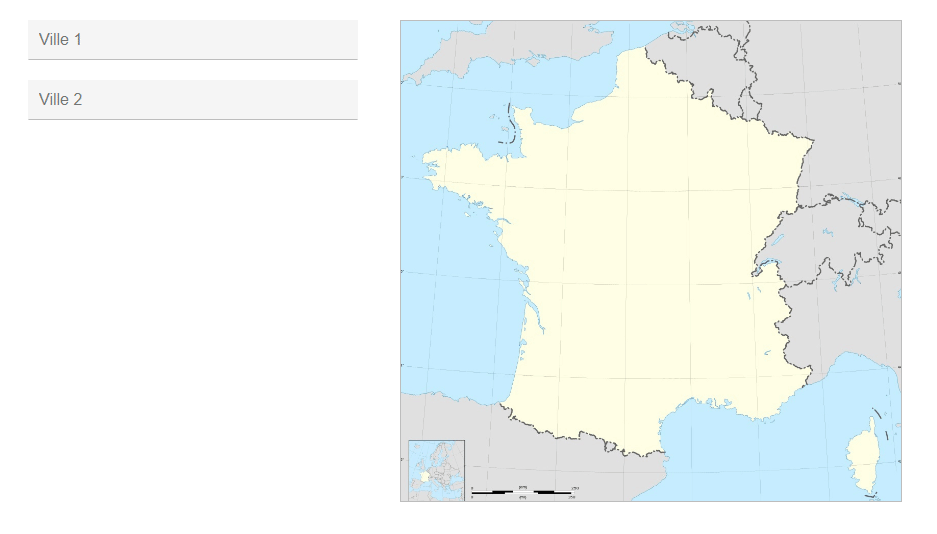

[](https://travis-ci.org/Klemek/Villes)
[](https://github.com/boyter/scc/#badges-beta)
[](https://coveralls.io/github/Klemek/Villes?branch=master)
[](https://lgtm.com/projects/g/Klemek/Villes/context:java)
[](https://lgtm.com/projects/g/Klemek/Villes/context:javascript)
[](https://lgtm.com/projects/g/Klemek/Villes/alerts/)

# Villes

J2EE app to calculate distance between 2 french cities



`release.properties`
```
http_request_timeout=10000
db_version=3
db_connection_string=jdbc:mysql://(host):3306/(db)?useLegacyDatetimeCode=false&serverTimezone=UTC
#User with data manipulation (SELECT, DELETE, ...)
db_user=
db_password=
#User with data and structure manipulation (DROP, CREATE, ...)
db_super_user=
db_super_password=
```
